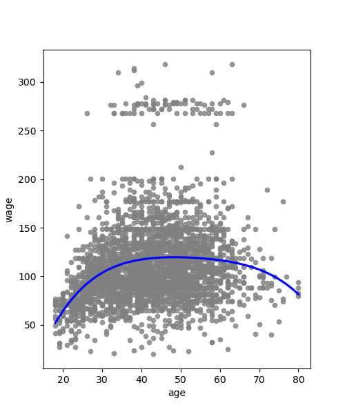

# git-intro

A demo repository with guidelines for assignment submission.

## Reproducibility

* Reproducibility is paramount -- if someone else can't reproduce your results, there's no point.
  * [Jupyter notebooks have reproducibility problems](https://www.nature.com/articles/d41586-021-01174-w),
so they're not acceptable for assignment submission.
  * ...but they're great for protoytping, in-class exercises and publishing books!
* Document the entire data-processing pipeline
  * The entire pipeline must be reproducible on the command line, starting with the original data source.
  * Document your data source(s) and show how to access the original source(s) whenever possible.
* Use Make
  * If you're not sure why, then read: [Why Use Make](https://bost.ocks.org/mike/make/) by the legendary Mike Bostock
  * Provide clear instructions for every step in the data-processing pipeline, including data access.
  * Document for the 6-month rule: after 6 months away, you can instantly pick up where you left off.
* Acknowlgement is critical
  * Acknowledge your predecessors (a side benefit: it's a good way to avoid plagiarism).
  * Cite your references (for many of the same reasons).
* Write clean code
  * Strive for self-documenting code
  * Follow [PEP 8](https://peps.python.org/pep-0008/)
  * Apply the DRY principle (Don't Repeat Yourself)
    * For example, if multiple files use the same code, then put reused code in a module and import it.
* For assignments...
  * Put source code in the `./src` and figures in a `./figs`
  * Use one file for each question/step, not one file for all questions/steps.
  * Make your code self documenting as much as possible.
* If you need to download large data files...
  * Don't put the data into your git history
  * Instead, list the file(s) in a `data` directory and make sure to ".gitignore" that directory (see [git.md](git.md)).
  * If you keep a local copy of data in your repo, provide appropriate attribution.
  * And provide links to the original/authoritative data source.
* For projects
  * Consider adding [a license](https://docs.github.com/en/repositories/managing-your-repositorys-settings-and-features/customizing-your-repository/licensing-a-repository) to your repo.
  * Use miniconda and share your conda environment (see [conda.md](conda.md))
* And if you're not sure how to set up your development environment, see [setup.md](setup.md)

## Example assignment formatting

Suppose the assignment asks you to reproduce the first chart in Figure 1.1 of ISLR. A solution follows.

### Step 1: Data access

Download the CSV file from the [ISL](http://statlearning.com) website with the following command
```
make data/Wage.csv
```

* Note: this is automatic when you type `make q1` because of the Makefile configuration.
* This step is necessary when cloning the repo because `data` is in the .gitignore file.
* If you don't have the requisite software, like `make`, then check out [setup.md](setup.md)
* If you're not familiar with git, then check out [git.md](git.md).

### Q1

The graphic below reproduces Figure 1.1 of ISL. Recreate it with the following command:
```
make q1
```



* Note that the demo code imports a module.
* This markdown file embeds `figs/q1.png` using HTML:
```

```
* With HTML, you can set the desired width.
* If you're okay with the default width, you can use standard markdown syntax:
```

```
Refs:
  * [github flavored markdown](https://docs.github.com/en/get-started/writing-on-github/getting-started-with-writing-and-formatting-on-github/basic-writing-and-formatting-syntax)
  * [gfm spec](https://github.github.com/gfm/)
  * [embed a PNG in markdown](https://docs.github.com/en/get-started/writing-on-github/getting-started-with-writing-and-formatting-on-github/basic-writing-and-formatting-syntax#images)
  * [math in markdown](https://docs.github.com/en/get-started/writing-on-github/working-with-advanced-formatting/writing-mathematical-expressions)

$$
\int e^x dx = e^x + \mathrm{const}
$$
